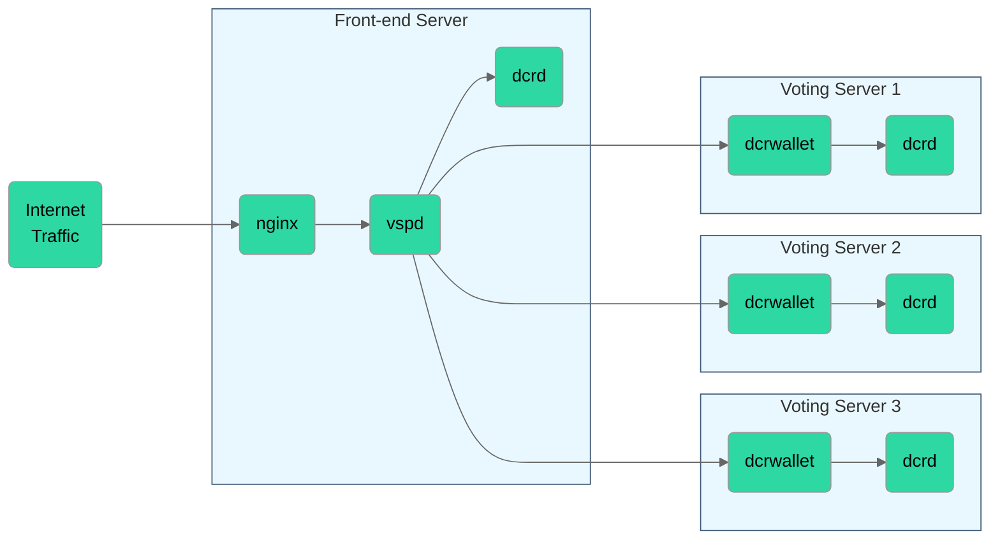

# Deployment Guide

This guide is deliberately written at a high level and with minimal details
because it is assumed that VSP operators will already have a level of
familiarity with Decred software and a level of sysadmin experience.



## Prerequisites

### Build from source

Compiled binaries are not provided for vspd - VSP operators are expected to
build vspd from source.

When deploying vspd to production, always build all binaries from release
branches.
Neither vspd nor its dependencies (dcrd/dcrwallet) should be built from master
when handling mainnet tickets.

### Fee wallet

A wallet should be created to collect VSP fees. Ideally this would be a cold
wallet which is not used for any other purpose, and it should be completely
separate from the vspd infrastructure. The dcrwallet `getmasterpubkey` RPC
should be used to export an extended public (xpub) key from one of the wallet
accounts. This xpub key will be provided to vspd through a CLI flag, and it will
be used to derive addresses for receiving fee payments.

## Voting Servers

A vspd deployment should have a minimum of three remote voting wallets. The
servers hosting these wallets should ideally be in geographically separate
locations.

Each voting server should be running an instance of dcrd and dcrwallet. The
wallet on these servers should be completely empty and not used for any purpose
other than voting tickets added by vspd.
dcrwallet should be permanently unlocked and have voting enabled
(`--enablevoting`). dcrwallet is also required to have the manual tickets
option (`--manualtickets`) enabled which disables dcrwallet adding tickets
arriving over the network.
This prevents a user from reusing a voting address and the VSP voting multiple
tickets with only a single fee payment.
vspd on the front-end server must be able to reach each instance of dcrwallet
over RPC.

## Front-end Server

The front-end server is where vspd will be running. A webserver (eg. nginx)
should be configured with SSL and used to proxy requests from the internet to
vspd. **Do not run a voting wallet on your webserver.**

1. Start an instance of dcrd on this server with transaction index enabled
   (`--txindex`). dcrd is used for fishing ticket details out of the chain, for
   receiving `blockconnected` notifications, and for broadcasting and checking
   the status of fee transactions.

1. Run `vspd` with no arguments to write a default config file. Modify the
   config file to set your dcrd and dcrwallet connection details, and any other
   required customization.

1. A vspd database must be initialized before vpsd can be started. To do this,
   provide vspd with the xpub key it should use for collecting fees:

    ```no-highlight
    $ vspd --feexpub=tpubVppjaMjp8GEW...
    ```

1. Once the database is initialized, vspd can be started for normal operation by
   running it without the `--feexpub` flag.

1. Configure nginx with SSL and set up reverse proxy to forward requests to the
   vspd process. nginx must also set the `X-Forwarded-For` header to make vspd
   aware of the IP address of clients. Client IPs are used for logging and rate
   limiting.

    ```no-higlight
    server {
        location / {
            proxy_pass http://127.0.0.1:8800/;
            proxy_set_header X-Forwarded-For $proxy_add_x_forwarded_for;
        }
    }
    ```

## Monitoring

A monitoring system with alerting should be pointed at vspd and tested/verified
to be operating properly. An ideal solution would monitor the following:

- **Front-end host:**

  - vspd and dcrd processes are running.
  - No errors in vspd or dcrd logs.
  - Both dcrd and vspd are keeping up to date with new blocks.
  - Web front-end is accessible from the internet.
  - vspd `/admin/status` endpoint indicates no issues.

- **Voting wallet hosts:**

  - dcrwallet and dcrd processes are running.
  - No errors in dcrwallet or dcrd logs.
  - dcrwallet has voting enabled and is unlocked.
  - Both dcrd and dcrwallet are keeping up to date with new blocks.

### Logs

Any event logged at the `[ERR]` level is worthy of immediate investigation.
Examples include configuration or deployment issues, RPC failures and database
errors.

The `[WRN]` level is used to indicate events which are of interest, but do not
necessarily require investigation (eg. bad requests from clients, recoverable
errors).

### VSP Status

The current status of the VSP is displayed in a table on the `/admin`
page, and the same information can be retrieved as a JSON object from
`/admin/status` for automated monitoring. This endpoint requires Basic HTTP
Authentication with the username `admin` and the password set in vspd
configuration. A 200 HTTP status will be returned if the VSP seems
healthy, or a 500 status will be used to indicate something is wrong.

```bash
$ curl --user admin:12345 http://localhost:8800/admin/status
```

```json
{
  "dcrd": {
    "host": "wss://127.0.0.1:19109/ws",
    "connected": true,
    "bestblockerror": false,
    "bestblockheight": 802572
  },
  "wallets": {
    "wss://127.0.0.1:20111/ws": {
      "connected": true,
      "infoerror": false,
      "daemonconnected": true,
      "voteversion": 10,
      "unlocked": true,
      "voting": true,
      "bestblockerror": false,
      "bestblockheight": 802572
    }
  }
}
```

## Backup

The bbolt database file used by vspd is stored in the process home directory, at
the path `{homedir}/data/{network}/vspd.db`. vspd keeps a file lock on this
file, so it cannot be opened by any other processes while vspd is running.

To facilitate back-ups, vspd will periodically write a copy of the bbolt
database to the path `{homedir}/data/{network}/vspd.db-backup`.
The backup file will also be written when vspd shuts down.
This file should be backed up often and regularly (probably at least hourly).
Backups should be transferred off-site, ideally to a server which is not part of
the vspd deployment.

It is also possible to generate and download a database backup on demand from
the admin page of the vspd web front-end.

## Disaster Recovery

### Voting Wallets

To recover from a total failure of a wallet or wallet server (or to add a new
wallet to the vspd deployment):

- Set up a new empty wallet. Ensure voting is enabled and the wallet is
  unlocked.
- Update the vspd config file to include the new wallet (and remove the old
  wallet if necessary).
- Restart vspd and it will connect to the new wallet and automatically insert
  all required data to bring it up to date.

### Front-end

The vspd database file contains everything needed to restore a vspd deployment
from scratch. Simply place the database file into the vspd data directory and
start vspd as normal. vspd will use the database to insert all necessary data
into all of the voting wallets.

## Listing on decred.org

The process for listing a new VSP on [decred.org](https://decred.org/vsp/), and
consequently in Decrediton, is detailed at
[docs.decred.org](https://docs.decred.org/advanced/operating-a-vsp/).
